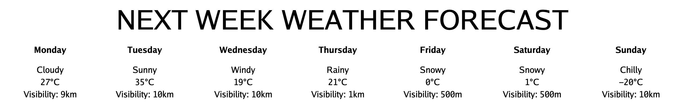

# Newbie test

## General information

* Topic: Weather forecast
* Submission method: GitHub repository
* Deadline: Sunday, 29 August 2021, 23:59:59

## Task

Build a web page to show weather forecast of the next 5 days. The data should be retrieved from OpenWeatherMap API, and the appropriate information should be displayed in one HTML file, so that it can be viewed by the browser.

As an example, here is the HTML output:



## Requirements

* There must be a piece of code to retrieve data from the API
* There must be a HTML file representing the forecast data in appropriate format

## Guidelines

You may follow this guideline to do the test.

1. Register an account at [OpenWeatherMap](https://openweathermap.org).
   * Click sign in and create an account
   * After successful registration, you will find an API key in your profile page. Save this to a secure place for later use.
2. Learn how to use the API.
   * [API call guide](https://openweathermap.org/forecast5#name5)
   * [API response guide](https://openweathermap.org/forecast5#JSON)
   * The endpoint is `https://api.openweathermap.org/data/2.5/forecast`
   * The parameters we are interested in are `q`, `appid`, and `units`
   * Remember you always need to supply the API key in every request (with `appid` parameter)
3. Write code to retrieve the forecast data, in JSON format.
   * If you use Python, you can use Python's [requests](https://docs.python-requests.org/en/master), and do something like:
   ```python
   import requests
   endpoint = ''
   apikey = '' # Do not write down API key like this in real code, and never commit API keys to git
   requests.get(endpoint, params={'param1': 'value1',
                                  'param2': 'value2',
                                  # ...
                                  'appid': apikey})
   ```
4. Write HTML (manually or programmatically) file to display the interesting forecast data.
5. Commit with git and push to GitHub, and submit the link to it.

## Security notice

Treat API keys as passwords, or even more than that. Never "git commit" files containing API keys. Instead, store the keys in a file and add that file name to `.gitignore`, or simply prompting to enter the keys. One way to prompt the key in Python would be:
```python
apikey = input('Enter API key: ')
```

## Hints

1. 5 day / 3 hour means the result is for 5 days with 3 hours steps (i.e. 22:00 - 1:00 - 4:00 etc.)
2. The API response, if success, has a `list` key. The value of it is an array of 40 timestamps (5 days x 8 timestamps each day (24 / 3 hours steps)).
   * Note that a day means 24 hours counting from the next available timestamp at the time the API call is made, not a full day from 0 to 23h59.
3. Each timestamp:
   * `dt`: you can parse it in Python with `datetime.datetime.fromtimestamp()` to determine which day is that
   * `weather[0].icon`: the full URL to get this icon is `http://openweathermap.org/img/wn/<icon_value>@2x.png`
4. The HTML result, if representing days, can use this table as a template:
```html
<!DOCTYPE html>
<html>
<head>
  <title>Forecast</title>
</head>
<body>
  <table style="width: 100%; text-align: center">
    <caption>NEXT 5 DAYS FORECAST</caption>
    <tr>
      <!-- Headers -->
    </tr>
    <tr>
      <!-- Field values -->
    </tr>
    <tr>
      <!-- Next fields' values -->
    </tr>
  </table>
</body>
</html>
```
5. In the repository where you commit your code, you can add a README file to explain what you did and how you understand the data (the file type either in `txt` or `md`).

## Support

Contact these people should any trouble come to you during the exam time:

* Do Quang Hieu ([facebook](https://facebook.com/quanghieu.do.737), [email](mailto:hieudq.bi10-063@st.usth.edu.vn))
* Duong Dang Hung ([facebook](https://facebook.com/danghung2207))

You can, of course, ask other newbies to understand the problem together, but the final code must be yours.